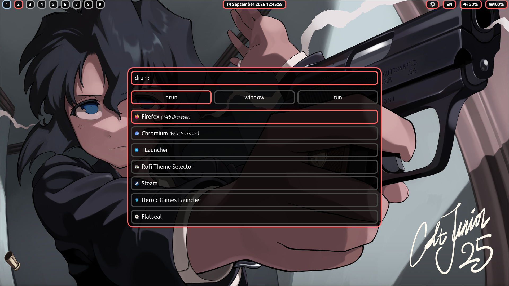
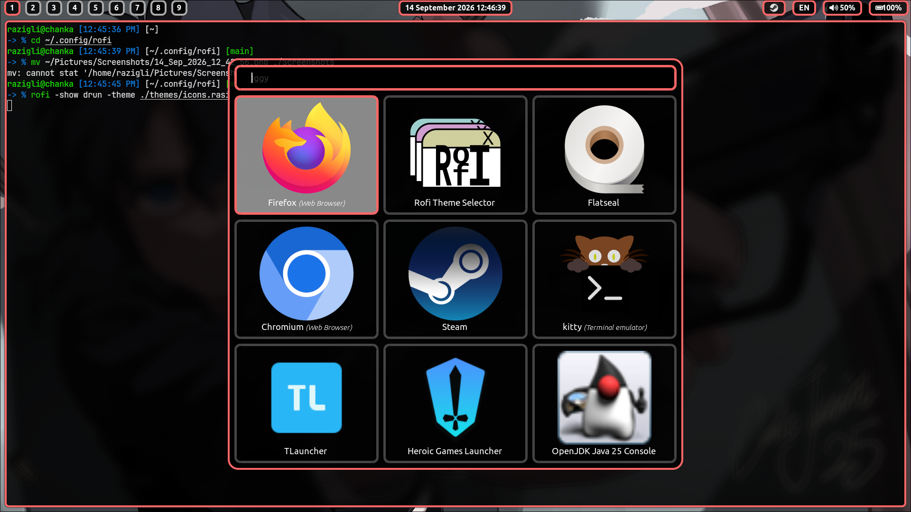
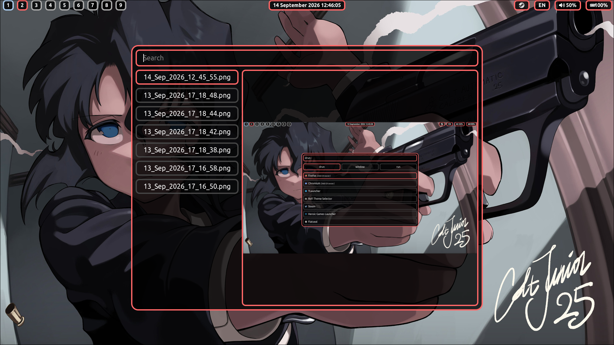

# install
```bash
[ -d $HOME/.config/rofi ] && mv $HOME/.config/rofi{,.bak}
git clone https://github.com/ilgizar-khis/rofi.git $HOME/.config/rofi
```
or

```bash
[ -d $HOME/.config/rofi ] && mv $HOME/.config/rofi{,.bak}
git clone https://github.com/ilgizar-khis/rofi.git
ln -s $PWD/rofi $HOME/.config/rofi
```

# themes
- list.rasi — modified and renamed "material.rasi(Dave Davenport,Tomaszal)"
- icons.rasi — modified and renamed "iggy.rasi(Qball)" 
- preview.rasi — modified and renamed "fullscreen-preview.rasi(Dave Davenport)"

# Screenshots



